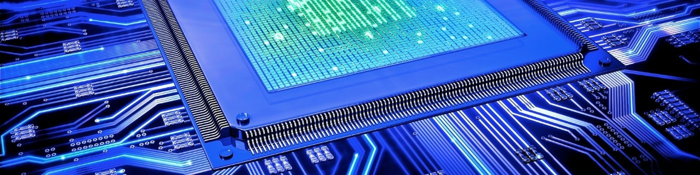

Hello! I'm a Embedded Software Engineer with electronics background. I'm currently specializing in Linux-based embedded systems.

     

## Some of my projects

- [Yocto Project: Distro layer example](https://github.com/bloppan/meta-app)
- [Linux userspace: Shared libraries and applications examples](https://github.com/bloppan/linux_userspace)
- [MCU Bootloader: Easy example of STM32 based bootloader](https://github.com/bloppan/uc_bootloader)

## :phone: Contact me
 

